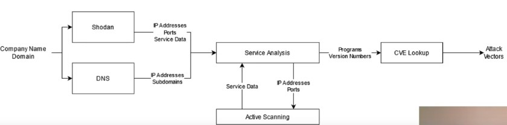

Advanced Python Scripting for Cybersecurity Specialization by INFOSEC
https://github.com/hposton/advanced-python-for-cybersecurity

# 1 Introduction

## 1.1 Performing reconnaissance
- Shodan search
- DNS Exploration
- Network scanning
- Service detection
- CVE lookup

After this, we have a lot of information about the target:
IP addresses, services, vulnerabilities, etc.

## 1.2 Gaining initial access
- Generating password variations
- Generating three random words
- Automating brute force

# 2 Establishing Command-and-Control and Finding Credentials

## 2.1 Establishing Command-and-Control 
- Traffic analysis
- Calculating entropy
- Detecting encodings
- Building C2 packets

## 2.2 Finding Credentials

- Credential access
- Dumping Chrome credentials
- Searching the registry
- Searching the system
- Cracking Linux passwords
- Analyzing passwords